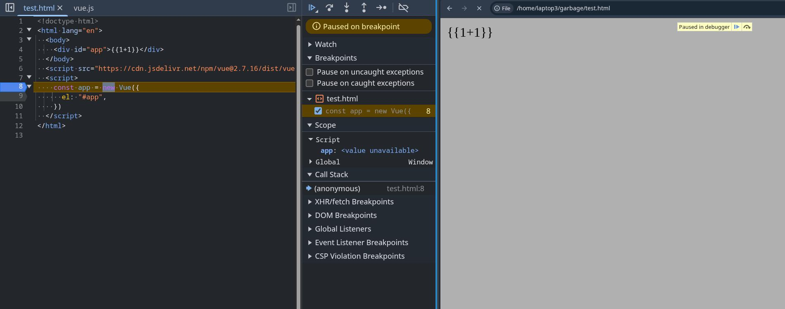
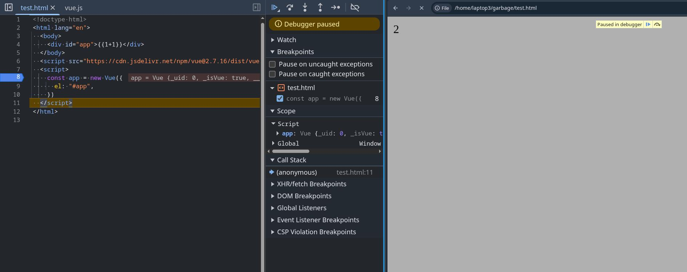
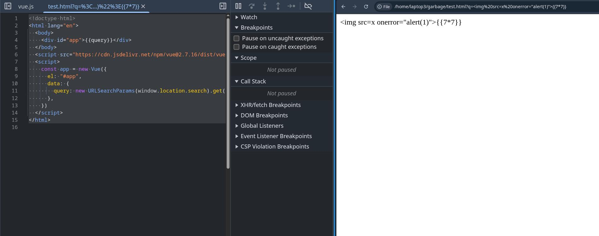
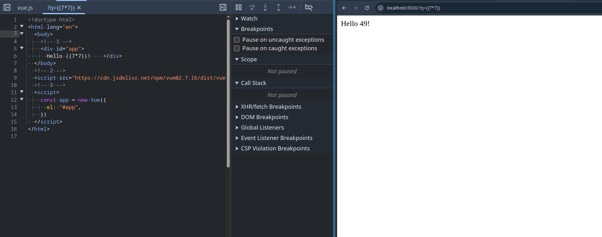
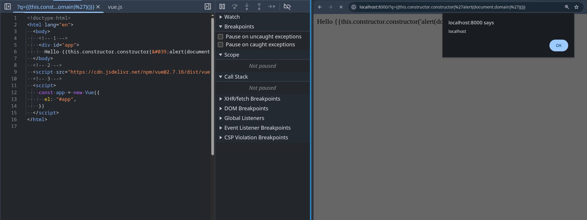

::: v-pre

# A summary of how CSTI works

To understand how CSTI works you first have to understand how frontend javascript frameworks embed dynamic content onto the page. I decided to use Vue to demonstrate this, but this concept would apply for React, Angular, and any other frameworks out there.

The simplest code I could come up with the demonstrate this is as follows:

```html
<!doctype html>
<html lang="en">
  <body>
    <!-- 1 -->
    <div id="app">{{1+1}}</div>
  </body>
  <!-- 2 -->
  <script src="https://cdn.jsdelivr.net/npm/vue@2.7.16/dist/vue.js"></script>
  <!-- 3 -->
  <script>
    const app = new Vue({
      el: "#app",
    })
  </script>
</html>
```

If you copy paste the html code into a file on your computer and open the static HTML file in a browser, the final content will end up displaying `2`. The following steps that the page takes to render `2` is as follows (see comments in the page for which code is responsible for each step):

1. The HTML page is loaded with the content: `{{1+1}}`
2. The Vue script is loaded from a CDN or some other source
3. The HTML page runs the Vue initialization function, which detects any values between `{{}}` brackets, evaluates the values as javascript, then displays whatever the returned value of the evaluation is.

As a visual example, here is what the page looks like before and after Vue is initialized:

- before Vue is initialized: 
  

- after Vue is initialized: 
  

Even if the value inserted in `{{}}` brackets is controllable by user input, it would still be safe as any value inserted from user input would be treated as a string before being inserted.

For example, if we were to modify the code like so:

```html
<!doctype html>
<html lang="en">
  <body>
    <div id="app">{{query}}</div>
  </body>
  <script src="https://cdn.jsdelivr.net/npm/vue@2.7.16/dist/vue.js"></script>
  <script>
    const app = new Vue({
      el: "#app",
      data: {
        query: new URLSearchParams(window.location.search).get("q"),
      },
    })
  </script>
</html>
```

and input the search parameter:

```
?q={{7*7}}
```

The input would be treated as a string and would not execute any code



As you can see, Vue on its own is safe and shouldnt give an attacker a way to execute arbitrary javascript. The template for the HTML page where Vue will insert it's data is prefined and will not change. However, issues occurs when the user is given control over the HTML page's template itself.

Lets take the following php code for example. I took the previous example and modified it into a php file by copy pasting [this line](https://www.php.net/manual/en/reserved.variables.get.php#:~:text=Example%20%231%20%24_GET%20example) from the PHP docs into the HTML page.

```php
<!-- 0 -->
<!doctype html>
<html lang="en">
  <body>
    <!-- 1 -->
    <div id="app">
      <?php echo 'Hello ' . htmlspecialchars($_GET["q"]) . '!'; ?>
    </div>
  </body>
  <!-- 2 -->
  <script src="https://cdn.jsdelivr.net/npm/vue@2.7.16/dist/vue.js"></script>
  <!-- 3 -->
  <script>
  const app = new Vue({
    el: "#app",
  })
  </script>
</html>
```

Suddenly, there is now a step 0 in how the page is rendered. The following steps that the page takes to render is now:

<ol start="0">
  <li>The php server first dynamically generates a HTML page based on user input then sends the HTML page to the client's browser</li>
  <li>The HTML page is loaded with the content</li>
  <li>The Vue script is loaded from a CDN or some other source</li>
  <li>The HTML page runs the Vue initialization function, which detects any values between <code>{{}}</code> brackets, evaluates the values as javascript, then displays whatever the returned value of the evaluation is.</li>
</ol>

As you can see, steps 1, 2, and 3 pretty much stay the same. However, now there is now a step 0. In that step 0, the user can input `{{}}` brackets themselves to be added to the page on the server side, cause Vue to recognize them the values between them as values it needs to evaluate, and execute the contents as javascript, allowing for arbitrary javascript execution.

If you want to try this yourself, copy paste the modified HTML code into a file called `test.php`, then run:

```
php -S 127.0.0.1:8000 test.php
```

accessing the web page with the query parameter:

```
http://localhost:8000/?q={{7*7}}
```

results in the server generating the following HTML and the client being sent:

```html
<!doctype html>
<html lang="en">
  <body>
    <div id="app">
      {{7*7}}
    </div>
  </body>
  <script src="https://cdn.jsdelivr.net/npm/vue@2.7.16/dist/vue.js"></script>
  <script>
  const app = new Vue({
    el: "#app",
  })
  </script>
</html>
```

Vue will now execute the user input as javascript and display `49` on the webpage:



and inputing the following query parameter

```
http://localhost:8000/?q={{this.constructor.constructor('alert(document.domain)')()}}
```

will result in an alert box being popped:



If you're wondering why the alert payload looks like this:

```javascript
this.constructor.constructor('alert(document.domain)')()
```

and not this:

```javascript
alert(document.domain)
```

it's because Vue has some sort of sandboxing feature that makes it impossible to call `alert` directly in the `{{}}` brackets.

:::
