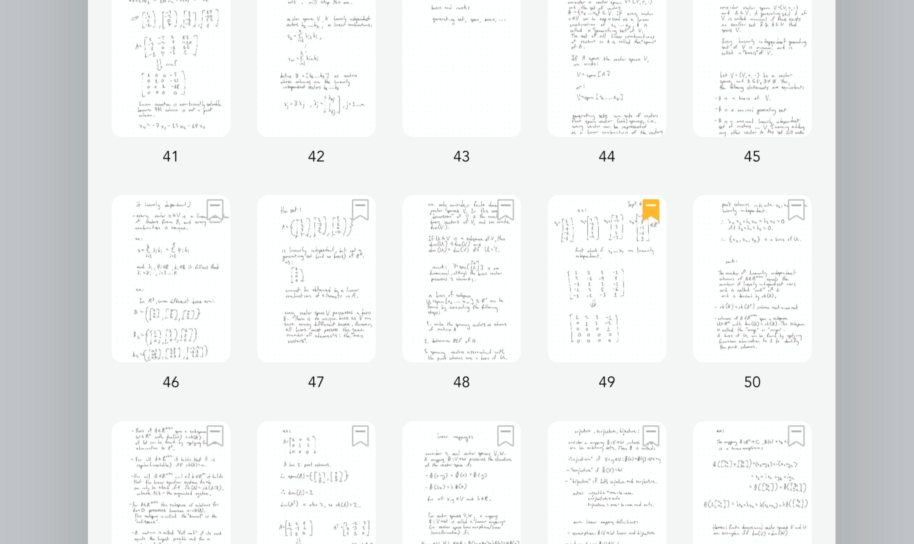
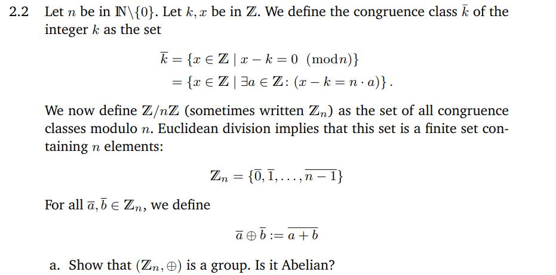

<figure>
  
  <figcaption>Linear algebra notes</figcaption>
</figure>

Hello there. It has been a week since I suddenly had a impulse urge to start learning about ML/AI. I feel pretty good about my progress currently with this topic. This is honestly way more fun than doing CTF challenges and cybersecurity stuff in my opinion. 

# Current Progress

For the past week, I have just been reading chapter 2 of [Mathematics for Machine Learning](https://mml-book.github.io/), which is pretty much entirely dedicated to linear algebra. As of yesterday, I have finished reading the entirety of chapter 2, which to be honest, has been insanely hard to understand. My approach to reading this chapter has been to take notes on my ipad about the book contents and to do any example problems that are outlined in the chapter by myself without referencing the book in order to get a feel on how to do the problems. With this approach, reading every page has taken me an average of 20-30 minutes to read, and my head also feels like it's been ran over by a truck everytime I try to understand a page. However, I have found other resources online that teach the same material outlined in this current chapter, such as:

- [This google doc with supplementary materials to read with the book](https://docs.google.com/document/d/1qyBUjkeYUfF4LhJux0dwJItQxDxmoxDRoXPVeQGUAU0/edit?usp=sharing)
- [Paul's math notes on linear algebra](http://www.cs.cornell.edu/courses/cs485/2006sp/LinAlg_Complete.pdf)
- [MIT open courseware linear algebra lectures on youtube](https://youtube.com/playlist?list=PLE7DDD91010BC51F8&si=sFLyZoll129IEQ4f)
- [3Blue1Brown's essence of linear algebra playlist](https://www.youtube.com/playlist?list=PLZHQObOWTQDPD3MizzM2xVFitgF8hE_ab)

I have found these resources somewhat easier to understand compared to reading the Mathematics for Machine Learning textbook, so I have been using these resources to understand the book's content alongside actually reading the textbook.

Currently, I have been doing the chapter 2 end of chapter exercises, and I have currently finished 1/4th of the problems. Some of these problems are pretty hard to understand, An example of a problem I have found to be pretty hard to understand is this problem:

Like wtf is a congruence class? Am I somehow supposed to know this prior to trying out this challenge? Maybe I was taught this in school but just didn't pay attention to class or something?

My bad didn't mean to rant. I just thought that question was kinda hard. Anyways, my plans for next week will probably be to finish every chapter 2 exercise, then move on to chapter 3 of the MML book, which is about something called abstract geometry. I kinda skimmed through the chapter at some point when I got bored of linear algebraing, and it seems to be about 3D space stuff such as vectors, directions, and angles. I got no idea though. Gonna have to read the chapter to get a better idea of what I'm talking about here.

That's all the updates I got for this week. See you next week :)
