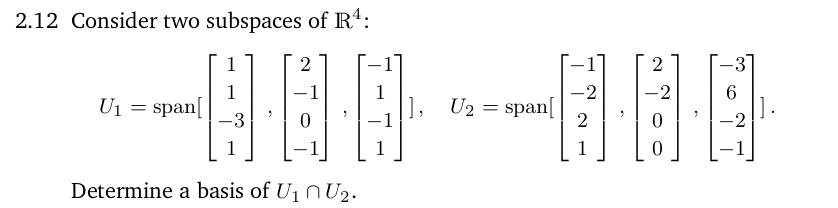

Last week I wrote about me being finished reading chapter 2 of [Mathematics for Machine Learning](https://mml-book.github.io/), how I was starting to do the end of chapter exercises, and how I was gonna move on to the next chapter of the book once I was done with the exercises. Turns out, there were some problems in that exercise set that bamboozled me so hard that I feel like I gotta spend more time getting better at linear algebra before reading the next chapters.

There was one problem in particular (problem 2.12) about the basis of the intersection of 2 subspaces that I spent almost 2 days trying to understand to no avail. Here is the problem:

<figure>
  
  <figcaption>To the 4 people that I know who currently read my weekly updates: please refrain from sending "this question is easy" messages in my DMs. I don't want to hear it.</figcaption>
</figure>

 I spent those 2 days trying to reread the textbook, watching youtube videos on similar problems, [reading Stack Exchange forums](https://math.stackexchange.com/questions/4836923/finding-a-basis-for-the-intersection-of-two-subspaces-in-bbbr4), and prompting AI models to explain it to me. After 2 days of doing that though I still couldn't understand shit and also felt like I forgot everything I read and learnt about linear algebra in the week prior to doing the exercises, so I decided to reread about all the linear algebra topics again.

I decided to continue learning off [Paul's math notes](http://www.cs.cornell.edu/courses/cs485/2006sp/LinAlg_Complete.pdf) entirely now, as it covers mostly the same material in the MML book but it's easier to read. I feel like the MML textbook was too verbose for my liking and contained too many weird math symbols that I had to constantly google the meanings for. Paul's math notes also contains chapters about determinants and Euclidean n-space in between learning about matrix calculations, linear transformations, and vector spaces. I think the MML book also covers this information in chapters 3 and 4 too. It's separated from the chapter about linear algebra though. I have no idea why.

Yeah so I guess this week I made negative progress. I thought I was gonna go read the next chapter of the MML book but just ended up having to understand linear algebra basics more deeply than from reading the MML book's chapter 2 once. I guess I shouldn't have expected to have learnt that much linear algebra and to have understood it all in the span of a week. This stuff is kinda hard :/ 

~~Maybe by next week I'll be done with learning about linear algebra and move on to other math topics?~~ Nevermind I'm not claiming anything about my progress next week. See you next week. Hopefully I don't end up making negative progress again...

